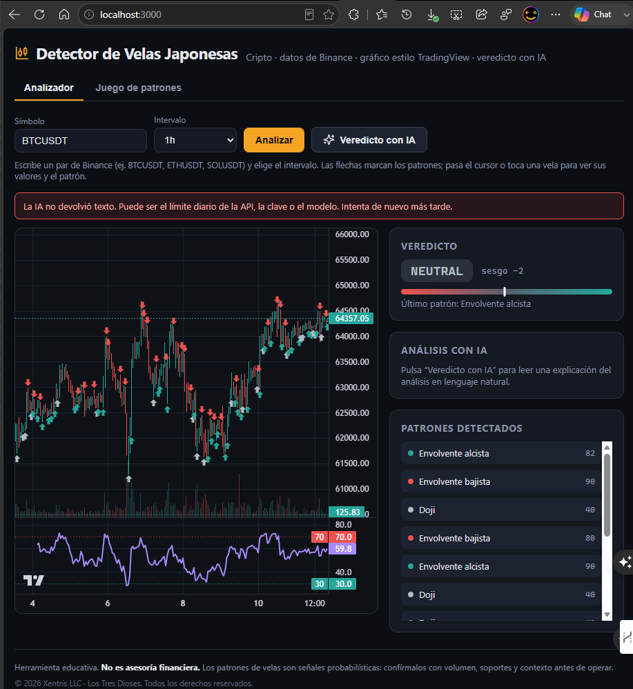
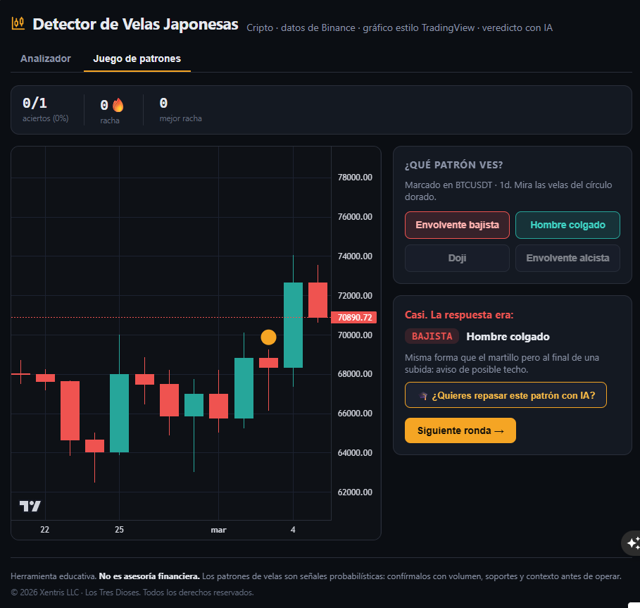

<div align="center">


# Detector de Velas Japonesas

**Detecta patrones de velas japonesas en cripto, visualízalos como en TradingView y obtén un veredicto con IA — además de un juego para aprender a reconocerlos.**

<sub>Un producto de **XENTRIS** · Más que tecnología, soluciones que impulsan tu crecimiento.</sub>

[](https://detector-velas.vercel.app)

[](https://nextjs.org/)
[](https://react.dev/)
[](https://www.typescriptlang.org/)
[](https://tradingview.github.io/lightweight-charts/)
[](https://ai-sdk.dev/)

</div>

---

## Qué hace

- 📊 **Gráfico tipo TradingView** con panel de **RSI(14)** y **tooltip por vela** (OHLC + patrón), usando `lightweight-charts` v5.
- 🔍 **Detección de 16 patrones** de velas (1, 2 y 3 velas) con un motor por reglas — preciso, determinístico y gratis.
- ⚖️ **Veredicto alcista / bajista / neutral** con un sesgo ponderado y un medidor visual.
- 🤖 **Explicación con IA en streaming** (Vercel AI SDK): la IA redacta el veredicto token a token — no decide el patrón, solo lo explica.
- 🎮 **Juego de entrenamiento** para aprender a identificar patrones, con puntaje, racha y **repaso con IA** cuando fallas.

> [!NOTE]
> El gráfico, el RSI, la detección y el juego funcionan **sin** clave de OpenAI. La clave solo se necesita para el veredicto y las lecciones con IA.

## Vistazo

<table>
  <tr>
    <td width="50%" align="center">
      <br />
      <sub><b>Analizador</b> — velas + RSI + patrones + veredicto</sub>
    </td>
    <td width="50%" align="center">
      <br />
      <sub><b>Juego de patrones</b> — adivina, puntúa y repasa con IA</sub>
    </td>
  </tr>
</table>

## Cómo funciona

```
Binance ──► /api/candles ──► detectPatterns() ──► gráfico + RSI + veredicto
                                   │
                      (patrones + sesgo) ──► /api/analyze ──► IA ──► explicación (stream)
```

1. El backend baja las velas OHLC del endpoint público de **Binance**.
2. `lib/patterns.ts` analiza cada vela con reglas y detecta los patrones.
3. Se calcula un **sesgo global** ponderando los patrones más recientes.
4. El gráfico marca los patrones con flechas y muestra un panel de RSI; al pasar el cursor (o tocar) una vela ves su OHLC y el patrón.
5. Al pulsar **Veredicto con IA**, la explicación se escribe en vivo.

### Patrones detectados

| Velas | Patrones |
|-------|----------|
| **1** | Doji · Martillo · Hombre colgado · Estrella fugaz · Martillo invertido · Marubozu alcista/bajista |
| **2** | Envolvente alcista/bajista · Línea penetrante · Nube oscura · Harami alcista/bajista |
| **3** | Estrella de la mañana · Estrella del atardecer · Tres soldados blancos · Tres cuervos negros |

### 🎮 Juego de patrones

Se muestra un tramo real de velas con un patrón marcado y adivinas cuál es entre 4 opciones. Feedback inmediato con la explicación, **puntaje y racha**. Si fallas, el botón **"¿Quieres repasar este patrón con IA?"** genera una mini-lección didáctica para aprender de forma autodidacta.

## Stack

| Área | Tecnología |
|------|------------|
| Framework | Next.js 15 (App Router) · React 19 · TypeScript |
| Gráficos | `lightweight-charts` v5 (motor de TradingView) |
| Datos | Binance (`data-api.binance.vision`, sin API key) |
| IA | Vercel AI SDK (`streamText`) + OpenAI |
| Validación / robustez | Zod · rate-limiting · caché en memoria |
| Hosting | Vercel |

## Puesta en marcha

### Requisitos

- Node.js 18+
- (Opcional) Una clave de OpenAI para las funciones de IA

### Instalación

```bash
git clone https://github.com/xentristech/detector-velas.git
cd detector-velas
npm install
```

### Configuración

```bash
cp .env.example .env.local
```

```env
OPENAI_API_KEY=sk-tu-clave-aqui
OPENAI_MODEL=gpt-4o-mini   # opcional
```

> [!WARNING]
> Nunca subas tu `.env.local` ni tu clave al repositorio. Ya está en `.gitignore`.

### Ejecutar

```bash
npm run dev       # desarrollo → http://localhost:3000
npm run build     # compilar para producción
npm run start     # servir la build
```

## Estructura

```
app/
  page.tsx              Interfaz (pestañas: Analizador / Juego)
  api/
    candles/route.ts    Binance + detección de patrones
    analyze/route.ts    Veredicto con IA (streaming)
    game/route.ts       Ronda del juego
    lesson/route.ts     Repaso con IA del patrón fallado
components/
  CandleChart.tsx       Gráfico de velas + RSI + tooltip
  GameChart.tsx         Gráfico del juego
  PatternGame.tsx       Lógica y UI del juego
  Markdown.tsx          Renderizador Markdown mínimo y seguro
lib/
  patterns.ts           Motor de detección + catálogo
  indicators.ts         RSI (suavizado de Wilder)
  binance.ts            Cliente de Binance (con caché)
  schemas.ts            Validación con Zod
  rate-limit.ts         Rate limiting en memoria
  types.ts              Tipos compartidos
```

## Despliegue

Desplegado en **Vercel**. Agrega `OPENAI_API_KEY` en las variables de entorno del proyecto (Settings → Environment Variables), nunca en el código.

> [!IMPORTANT]
> Se usa `data-api.binance.vision` en lugar de `api.binance.com` porque este último bloquea las IPs de EE. UU., donde corren los servidores de Vercel.

## Aviso

> [!CAUTION]
> Esta herramienta es **educativa** y **no es asesoría financiera**. Los patrones de velas son señales probabilísticas: confírmalos siempre con volumen, soportes/resistencias y contexto del mercado antes de operar.

---

<div align="center">

© 2026 **Xentris LLC** · Los Tres Dioses. Todos los derechos reservados.

</div>
